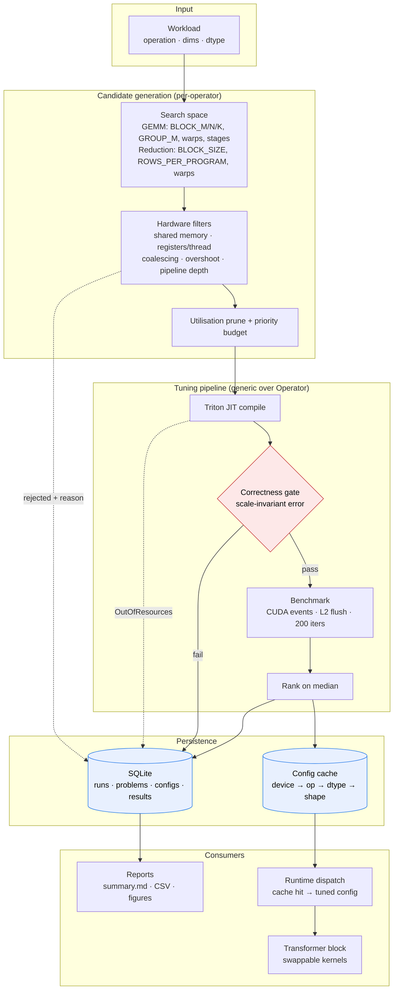

<div align="center">

# KernelForge

**A GPU kernel autotuning framework that cannot rank an incorrect kernel.**

[](https://github.com/BruceMoseti/KernelO/actions/workflows/ci.yml)


</div>

A Triton/CUDA kernel's performance is decided almost entirely by five integers —
tile shape, warp count, pipeline depth — and the right values depend on both the
problem shape and the specific GPU. KernelForge generates those configurations
from the properties of the attached device, rejects the ones the hardware cannot
run (each with a stated reason), **verifies every survivor against a PyTorch
reference before timing it**, benchmarks with CUDA events, ranks on the median,
records every result to SQLite with full hardware provenance, and caches the
winner so a serving process never re-tunes.

The last part matters more than it sounds. A tuner that ranks on latency alone
will happily select a kernel whose boundary mask is broken, because skipping
work is fast. Here, verification is a separate pass that runs *before* the
benchmark loop, which makes that failure structurally impossible rather than a
matter of care.

---

## Key highlights

| | |
| --- | --- |
| **Hardware-derived search space** | A 432-point GEMM grid reduces to 180 feasible and 48 measured candidates. Filters come from device limits — shared memory, registers per thread, 128-byte transactions, pipeline depth, parallelism — so they transfer across GPUs, and every rejection is attributed to a named rule. |
| **Correctness gate before ranking** | Scale-invariant error metric (`max\|out−ref\| / max\|ref\|`) with per-dtype thresholds. An incorrect configuration is recorded with its error and dropped, never timed. |
| **Kernels verified with no GPU** | 5 Triton kernels and 1 handwritten CUDA kernel are lowered to PTX/cubin for `sm80` and `sm90` in ordinary CPU CI. Tests assert tensor-core MMA selection and per-element instruction counts **from the generated PTX**. |
| **481 tests** | 189 run on a CPU-only machine; 292 are GPU-gated and skip with a reason. Correctness covers primes, one-off-a-tile sizes and degenerate single rows across 3 dtypes and 5 tile shapes. |
| **Operator fusion, quantified** | Bias + GELU folded into the GEMM epilogue: 3 kernel launches → 1, and total DRAM traffic at 4096×11008×4096 fp16 falls from 548 MiB to 204 MiB (2.7×). |
| **Roofline-aware reporting** | Arithmetic intensity is reported against the device ridge point: 1024 FLOP/byte for a prefill GEMM versus **1.0** for single-token decode — 153× below an A100's roof, so no tiling can make it compute-bound. |

> **On performance numbers**
>
> **This repository contains no measured latency figures, deliberately.** It was
> built on a machine with no GPU, so every number is produced by running the
> tools below on your own hardware and is stamped with the GPU, driver, CUDA,
> PyTorch and Triton versions it was measured on.
>
> What is committed instead is the measurement apparatus and a verification
> strategy that does not need a device: Triton and clang can both lower kernels
> to PTX for a named architecture with no driver present, so kernel correctness
> at the instruction level is a normal CI check here. Everything in the table
> above is reproducible by inspection — see [Verification](#verification).

---

## Demo

Candidate generation runs without a GPU, so the most interesting output is also
the easiest to reproduce:

```console
$ kernelforge tune matmul --m 2048 --n 4096 --k 4096 --dtype fp16 --explain

matmul M/N/K=2048 x 4096 x 4096 fp16
  grid points      : 432
  feasible         : 180
  after prune      : 180
  selected (budget): 48 of 48
  rejections by rule:
     105  uncoalesced A tile
      81  tile too small
      30  uncoalesced B tile
      27  too little output per warp at num_warps=8
       9  register pressure
```

Every one of those 252 rejections is attributable to a hardware rule, not a
heuristic cutoff. Changing the problem changes the space — a single-token decode
GEMM leaves only 30 candidates, all at the smallest tile the grid offers,
because 150 points now overshoot a problem that is one row tall:

```console
$ kernelforge tune matmul --m 1 --n 11008 --k 4096 --explain

matmul M/N/K=1 x 11008 x 4096 fp16
  grid points      : 432
  feasible         : 30
  after prune      : 30
  selected (budget): 30 of 48
  rejections by rule:
     150  tile overshoot
     105  uncoalesced A tile
      81  tile too small
      30  uncoalesced B tile
      27  too little output per warp at num_warps=8
       9  register pressure
```

With a GPU attached, `kernelforge tune` runs the full pipeline. Latencies are
shown as dots below because they are *not* measurements; only the
shape-derived quantities, which do not depend on hardware, are filled in:

```console
$ kernelforge tune matmul --m 2048 --n 4096 --k 4096 --dtype fp16

GPU:    NVIDIA A100-SXM4-80GB
Shape:  2048 x 4096 x 4096  (M/N/K)
dtype:  FP16

Verifying candidates... (48 to check)
.. / 48 configurations passed correctness
Benchmarking...

Search space: 432 grid points, 180 feasible, 48 measured in ..s

Best configuration
------------------
BLOCK_M:      ..
BLOCK_N:     ...
BLOCK_K:      ..
GROUP_M:       8
num_warps:     .
num_stages:    .

Performance
-----------
triton_autotune:     ..... ms
torch_compile:       ..... ms
torch_eager:         ..... ms
triton_baseline:     ..... ms
kernelforge:         ..... ms

speedup vs torch_eager:                ....x
speedup vs torch_compile:              ....x
speedup vs triton_baseline:            ....x
speedup vs triton_autotune:            ....x
throughput:                     .... TFLOP/s
arithmetic intensity:       1024.0 FLOP/byte
```

The last line is the one to read first. At 1024 FLOP/byte this shape sits 6.7×
above an A100's ridge point of ~153, so it genuinely can be compute-bound and
tuning the tiling is worth doing. A shape *below* the ridge point cannot be, and
the honest conclusion there is that the kernel is already finished — see
[§ Benchmark methodology](#benchmark-methodology).

`kernelforge report` reads the SQLite database and renders `summary.md`,
per-operator CSV exports, latency and throughput charts, a bandwidth chart for
the memory-bound operators, and a `BLOCK_M × BLOCK_N` latency heatmap. No figure
is ever transcribed by hand, so regenerating cannot go stale.

---

## Architecture



Three properties of this shape are load-bearing:

1. **The gate sits on the only path to the benchmark.** There is no edge from
   compile to rank that bypasses verification.
2. **Failures are data, not exceptions.** A rejected filter, a Triton
   `OutOfResources`, and a wrong answer all land in the same results table with
   a reason, so "48 of 432" is auditable rather than asserted.
3. **The tuner is generic over `Operator`.** It never mentions a GEMM. Adding an
   operator means implementing an interface, not editing the pipeline — which is
   what let RMSNorm bring a completely different parameter set.

---

## How it works

```
Problem(op, dims, dtype)
   │
   ├─ 1. SearchSpace.grid()          enumerate the full parameter grid (432 for a GEMM)
   ├─ 2. reject_reason()             drop infeasible points, each with a named reason  → 180
   ├─ 3. prune + priority budget     drop tilings that leave SMs idle, keep top 48
   │
   ├─ 4. make_inputs(seed)           reproducible inputs from a seeded Generator
   ├─ 5. reference()                 PyTorch result, TF32 disabled for fp32
   │
   ├─ 6. PASS A: compile + verify    every candidate, before anything is timed
   │      └─ fail → recorded with status + error, dropped from ranking
   ├─ 7. PASS B: benchmark           survivors only; CUDA events, L2 flush, 25 warmup / 200 iters
   ├─ 8. rank on median latency
   │
   ├─ 9. persist                     SQLite row per candidate + per baseline, with provenance
   └─ 10. cache                      best config under (board name, op, dtype, shape)
```

Two passes rather than one interleaved loop, because compiling candidate *i+1*
in the middle of timing candidate *i* pollutes the measurement. Five baselines
are timed under identical settings for comparison: PyTorch eager,
`torch.compile`, an untuned Triton configuration, Triton's own
`@triton.autotune`, and the handwritten CUDA kernel where one exists.

---

## Technical deep dive

### The search space is derived, not hand-written

The naive GEMM grid is 4×4×3×3×3 = 432 points. Measuring all of them costs
minutes per shape on configurations that cannot win. Each filter encodes a
hardware fact:

| Rule | Model | Why it binds |
| --- | --- | --- |
| Shared memory | `num_stages × BLOCK_K × (BLOCK_M + BLOCK_N) × itemsize` | Triton's pipeliner holds `num_stages` operand tiles in flight. A 128×128 tile at `BLOCK_K=64` over 4 stages needs 128 KiB — fits an A100's 163 KiB opt-in budget, does not fit an RTX 4090's 99 KiB. |
| Register pressure | `BLOCK_M × BLOCK_N / threads` fp32 accumulators per thread, capped at 128 | A thread can address 255 registers; the accumulator is only part of its demand, so 128×128 on 2 warps (256 per thread) spills to local memory. |
| Coalescing | `BLOCK_K × itemsize ≥ 64 B`, same for `BLOCK_N` | A load is issued in 128-byte transactions. Successive tile rows are strided by the full matrix dimension, so a 32-byte row segment wastes three quarters of every line it touches. |
| Tile overshoot | tile ≤ 2× the problem dimension, unless already the smallest in the grid | A tile larger than the problem computes masked-off work. The escape clause exists because the smallest `BLOCK_M` is 16, and without it every candidate for a single-token GEMM is rejected. |
| Pipeline depth | `num_stages ≤ ceil(K / BLOCK_K)` | There is nothing to overlap if the K loop is shorter than the pipeline. |
| Parallelism | grid ≥ half the SM count, *applied only when some tiling reaches a full wave* | Conditional because for a small enough problem no tiling fills the machine, and the least-bad option still has to be measured. |

Survivors are then sorted and truncated to a budget. The priority key is
`(−min(programs, sm_count), −reuse, waste)`; clamping the first term at the SM
count is what makes the same function correct in both regimes — for a large
problem every tiling fills the GPU, the term ties, and data reuse
`BM·BN/(BM+BN)` decides; for a 256×256 problem it cannot, and the term prefers
the tiling that keeps more multiprocessors busy.

Separating *filters* (hardware facts, which can exclude the true optimum if
wrong) from the *budget* (a cost bound, which cannot) is deliberate. All three
counts are reported so a shrinking space is visible rather than silent.

### Verifying GPU kernels without a GPU

`triton.compile` lowers a kernel to PTX **and cubin** for a named target with no
driver present. That turns a class of kernel bugs into ordinary CI failures, and
it makes some unusually specific assertions possible:

```python
# The fp16 GEMM must reach the tensor cores.
assert "mma.sync.aligned.m16n8k16" in compiled.ptx

# The GELU rewrite must cost exactly one hardware exponential per element.
per_thread = BLOCK_M * BLOCK_N // (num_warps * 32)
assert compiled.ptx.count("ex2.approx.f32") == per_thread
assert compiled.ptx.count("div.full.f32") == per_thread
```

The same approach covers the handwritten CUDA kernel: `clang++` in CUDA mode
compiles `__global__` code to PTX given only CUDA's headers and libdevice, both
installable from PyPI, so the device code is checked for `sm80` and `sm90`
without `nvcc`. The tests assert its instruction profile — five unrolled warp
shuffles (log₂ 32), two barriers, one `rsqrt` per instantiation, and no
out-of-line device calls.

This has a documented limit, which matters because it changes what a test may
claim: the standalone compile entry point does not run the software pipeliner,
so its shared-memory allocation stays at one buffer per operand however high
`num_stages` is — confirmed by inspecting the TTGIR, and unchanged by supplying
full pointer-divisibility hints. The CPU test therefore checks the single-buffer
tile footprint against the compiler's own figure, and the `num_stages` factor is
checked against a real launch in a GPU-gated test.

### Why the correctness metric is scale-invariant

`torch.allclose` needs an absolute tolerance that depends on the magnitude of
the data. A GEMM's output grows like `√K`, so a tolerance tuned at `K=512`
either rejects correct kernels at `K=8192` or waves through broken ones at
`K=128`. The gate is

```
err = max|out − ref| / max|ref|
```

against one threshold per dtype (fp32 `1e-5`, fp16 `5e-3`, bf16 `2e-2`), derived
from each format's output rounding with headroom for a differing summation
order. Elementwise mismatch counts are still reported — "0.4% of elements
differ" and "every element differs slightly" are different bugs — but they are
diagnostics, not the verdict.

One precision trap is handled explicitly. On Ampere and later, PyTorch may run
an fp32 matmul through TF32 tensor cores, whose 10-bit mantissa carries ~1e-3
relative error — a hundred times the fp32 threshold. `tl.dot` would do the same.
So the kernels pin `input_precision="ieee"` and the tuner disables TF32 for the
whole session, making every fp32 comparison IEEE-to-IEEE. The consequence is
stated plainly rather than hidden: **the fp32 PyTorch baselines here are slower
than what a PyTorch user gets by default**, because the default is TF32.

### The GEMM, and one trick that looks like a bug

Two pieces of `kernels/matmul.py` are worth reading:

**L2-aware program ordering.** With the obvious row-major program order, the
programs resident at any moment span one strip of C, touching `BLOCK_M` rows of
A and *all* of B. Launching in `GROUP_M`-row groups makes the concurrent working
set a square-ish block of C, so both operand strips stay small enough to live in
L2 and get reused by neighbouring programs. Identical arithmetic, identical
number of loads issued, far more of them served by cache.

**The `% M` wrap.** Operand pointers are computed modulo the problem dimensions:

```python
offs_am = (pid_m * BLOCK_M + tl.arange(0, BLOCK_M)) % M
```

This looks like it would corrupt the result. It does not: out-of-range rows read
some other valid row, `tl.dot` output lanes depend only on their own A row and B
column so wrapped lanes cannot contaminate valid ones, and the epilogue's store
mask discards them. Only the K axis needs a real mask, because a short final K
step must contribute zero rather than wrapped data. The payoff is no M/N masking
in the inner loop at all.

### Operator fusion with a falsifiable prediction

The unfused sequence materialises two full `M × N` intermediates:

```
x @ w      → tmp    write M·N
tmp + bias → tmp2   read M·N, write M·N
gelu(tmp2) → y      read M·N, write M·N
```

Three launches and `5·M·N` of output traffic against `M·N` fused. At
4096×11008×4096 fp16 that is total DRAM traffic of 548 MiB versus 204 MiB, a
344 MiB saving. The launch-count claim is structural and asserted directly in
`test_fusion_reduces_the_kernel_launch_count`; the traffic claim is a prediction
written down *before* measurement in
[`docs/CASE_STUDIES.md`](docs/CASE_STUDIES.md), together with the explicit
expectation that **latency will improve by less than the traffic ratio
suggests**, because the GEMM reads `M·K + K·N` of operands regardless.

The GELU itself is rewritten algebraically. Through `tanh(z) = 2σ(2z) − 1`,

```
0.5·x·(1 + tanh(z))   ⟶   x / (1 + exp(−2z))
```

which needs one hardware exponential instead of a `tanh`, depends on no Triton
version's libdevice bindings, and cannot overflow — a large negative argument
sends the exponential to `+inf` and the result to zero, the correct limit.

### Two stores, because they answer different questions

The **SQLite database** is the experiment log: every candidate including the
failures and why, with GPU, driver and library versions attached to the run.
Configurations are stored as a JSON parameter set plus a content digest rather
than as `block_m/block_n/block_k` columns — those columns cannot represent an
RMSNorm config, and a nullable column per operator parameter turns the table
into a sparse matrix every query must special-case.

The **config cache** is operational: one JSON file a process reads in
microseconds. Its key is the full board name plus architecture, not just the
compute capability, because an RTX 4090 and an RTX 4080 are both `sm89` with
different SM counts, L2 sizes and bandwidth. A cache file copied to another
machine therefore *misses* rather than silently serving a configuration tuned
for other hardware. Selecting a configuration never triggers tuning — a
thirty-second compile sweep inside an inference loop would be a bug.

---

## Engineering decisions

<details>
<summary><b>Separating hardware filters from the candidate budget</b></summary>

- **Problem.** 432 grid points per GEMM shape; measuring 180 feasible ones costs
  minutes of compiling per shape.
- **Approach.** Two distinct mechanisms: filters that encode what the hardware
  cannot do, and a budget that bounds search cost by keeping the top N under a
  documented priority ordering.
- **Why.** A filter can exclude the true optimum if its model is wrong. A budget
  cannot — it only costs the chance of finding it. Keeping them separate stops
  the filters from being quietly tightened until the count looks tidy.
- **Alternative considered.** Tightening the rules until ~50 candidates survive
  naturally. Rejected: the thresholds required had no hardware justification,
  which is exactly how a search space silently loses its optimum.
- **Tradeoff.** The budget can miss the best configuration on an unusual shape.
  Mitigated by reporting all three counts and making the budget a CLI flag.
</details>

<details>
<summary><b>Verification as a separate pass, before benchmarking</b></summary>

- **Problem.** A tuner ranking on latency alone prefers kernels that skip work,
  and a broken boundary mask is precisely a kernel that skips work.
- **Approach.** Pass A compiles and verifies every candidate; pass B times only
  the survivors.
- **Why.** It makes the invariant structural rather than a matter of discipline —
  there is no code path from compile to rank that bypasses the gate. It also
  keeps Triton's compilation of candidate *i+1* out of the measurement of
  candidate *i*.
- **Alternative considered.** Verify-then-time inside one loop. Rejected on the
  measurement-pollution ground alone.
- **Tradeoff.** Peak memory holds the reference output for the whole run, and a
  correct-but-slow candidate is compiled before being timed. Both are cheap
  next to a wrong winner.
</details>

<details>
<summary><b>Open key/value configurations instead of named GEMM fields</b></summary>

- **Problem.** A GEMM is tuned over `BLOCK_M/N/K`; an RMSNorm over
  `BLOCK_SIZE/ROWS_PER_PROGRAM`. They share no parameter.
- **Approach.** `KernelConfig` holds a hashable mapping; each operator's search
  space owns its schema. The database stores JSON plus a content digest.
- **Why.** Named GEMM fields would force every other operator to carry
  meaningless ones, and the awkwardness would propagate into the schema and
  every query.
- **Alternative considered.** Fixed columns per the obvious relational design.
  Rejected: it cannot represent an RMSNorm configuration at all.
- **Tradeoff.** Loses column-level type checking and direct SQL predicates on
  one parameter. Recovered where needed via `json_extract`, and the report layer
  expands the JSON into DataFrame columns, which is where that shape is useful.
</details>

<details>
<summary><b>In-process candidate execution, not subprocess isolation</b></summary>

- **Problem.** A kernel that triggers an illegal memory access poisons the CUDA
  context, and every later candidate in the process then fails.
- **Approach.** Run candidates in-process, catch and classify per-candidate
  exceptions, record them as rows.
- **Why.** A process launch plus a CUDA context per candidate is seconds each
  against a 48-candidate budget. Triton's own autotuner makes the same choice.
- **Alternative considered.** One subprocess per candidate. Rejected on cost,
  and because these kernels keep every load in bounds by construction (the `% M`
  wrap) so the exposure is to kernels added later.
- **Tradeoff.** A future kernel with an out-of-bounds access takes down the rest
  of the sweep. Accepted and documented; the failure is loud, not silent.
</details>

<details>
<summary><b>Shipping no benchmark numbers</b></summary>

- **Problem.** The project was developed with no GPU. Performance claims are the
  whole point of a tuning framework.
- **Approach.** Commit the apparatus with zero measured figures, and build a
  verification path that does not need a device (PTX-level compilation and
  instruction assertions in CI).
- **Why.** Plausible invented numbers would be undetectable to a casual reader
  and disqualifying to a careful one. A reviewer can reproduce every claim in
  this README by inspection.
- **Alternative considered.** Quoting published A100 figures as illustrative.
  Rejected: an illustrative number becomes a remembered number.
- **Tradeoff.** The README has no headline speedup, which is a real cost to a
  30-second reader. Partly recovered by reporting shape-derived quantities —
  traffic ratios, arithmetic intensity, candidate counts — which are exact and
  hardware-independent.
</details>

---

## Verification

The unusual property of this repository is how much is checkable without a GPU.

| Claim | Mechanism | Where |
| --- | --- | --- |
| Every kernel compiles for Ampere and Hopper | `triton.compile` → PTX + cubin for `sm80`/`sm90` | `tests/test_triton_compile.py` |
| Every budgeted candidate compiles, for a square *and* a decode shape | the same, over the real search space | `test_full_candidate_budget_compiles` |
| The fp16 GEMM reaches the tensor cores | `mma.sync.aligned.m16n8k16` asserted in generated PTX | `test_fp16_gemm_uses_tensor_cores` |
| The fused epilogue costs one exponential per element | `ex2.approx.f32` count vs accumulators per thread | `test_fused_epilogue_costs_one_exponential_per_element` |
| The shared-memory model matches the compiler | single-buffer tile footprint vs the compiler's allocation | `test_shared_memory_estimate_bounds_the_tile` |
| The CUDA kernel compiles for `sm80`/`sm90` | `clang++` in CUDA mode, no `nvcc` | `tests/test_cuda_rmsnorm.py` |
| Its instruction profile is as intended | 5 warp shuffles, 2 barriers, 1 `rsqrt`, no `.func` | `test_warp_reduction_is_fully_unrolled` |
| An incorrect configuration is never ranked | tuner driven end-to-end on a CPU operator whose configs fail in each real way | `tests/test_tuner.py` |
| Filters are device-specific | a tile feasible on an A100 is rejected for an RTX 4090, with neither attached | `test_shared_memory_filter_is_device_specific` |
| Importing the package needs neither Triton nor a CUDA context | each module imported in a fresh interpreter | `tests/test_cpu_only_imports.py` |

```console
$ make test                 # 188 passed, 1 skipped — no GPU required
$ make compile-check        # kernels → PTX for sm80 and sm90
$ make test-slow            # compile all 48 budgeted candidates
$ make test-all             # everything, on a machine with a CUDA device
```

---

## Benchmark methodology

Fully documented in [`docs/BENCHMARKING.md`](docs/BENCHMARKING.md). The parts
that matter most:

- **CUDA events on the active stream**, with a single synchronisation *after*
  the whole measurement loop, so per-iteration synchronisation cost stays out of
  the samples. A naive `perf_counter` around a launch measures enqueue time, not
  execution time.
- **L2 flushed before each timed iteration.** An L2-sized buffer is zeroed, and
  because the stream is in-order the zeroing is enqueued before `start_event` and
  is not inside the measured interval. This makes small problems look *slower*
  than a naive harness reports, which is the point: a cache-resident benchmark
  reports a bandwidth the kernel will never see in a real model.
- **Ranked on the median** of 200 iterations after 25 warmup. The minimum is the
  single luckiest sample; the mean is skewed by throttling and preempted
  launches — one outlier in two hundred moves it by an order of magnitude.
  p95/p99 are recorded alongside.
- **Cross-checked against `torch.utils.benchmark`** and asserted to agree within
  15% on a GPU. Two independent timing implementations agreeing is the evidence
  that the loop measures the kernel.
- **Identical settings for every implementation** — same warmup, iterations and
  flush setting, same seeded inputs, same precision policy. Otherwise the
  reported speedup is partly an artefact of the harness.

Derived metrics are reported per operator class: TFLOP/s for the compute-bound
GEMMs, GB/s for the memory-bound reductions, and arithmetic intensity against
the device's FLOP/byte ridge point — which is the first-order answer to whether
a kernel can be made faster at all.

---

## Tech stack

**Languages** · Python 3.10+, Triton (GPU DSL), CUDA C++, SQL

**GPU** · Triton 3.0+ (JIT and AOT compilation, PTX/cubin inspection), CUDA
(warp shuffles, shared-memory reductions, tensor-core MMA), PyTorch 2.2+ ATen
extension via `torch.utils.cpp_extension`

**Numerics** · NumPy, fp16/bf16/fp32 with explicit TF32 control, roofline
analysis

**Storage** · SQLite (stdlib `sqlite3`, hand-written schema and queries), JSON
config cache with atomic writes

**Profiling** · `torch.profiler` (kernel attribution, launch counts), NVIDIA
Nsight Compute (occupancy, SM/DRAM throughput, L2, warp stalls)

**Tooling** · pytest (markers for GPU/slow gating), ruff, GitHub Actions, Make,
Docker, pandas + matplotlib for report generation

---

## Repository structure

```
kernelforge/
├── kernels/              Triton kernels + the Operator interface the tuner drives
│   ├── matmul.py            blocked GEMM, L2-aware scheduling, tensor cores
│   ├── rmsnorm.py           single-pass row reduction, fp32 accumulation
│   ├── fused_linear.py      GEMM + bias + GELU in one launch
│   ├── softmax.py           numerically stable row-wise softmax
│   ├── vector_add.py        smallest full pass through the pipeline
│   ├── cuda_rmsnorm.py      on-demand loader for the handwritten CUDA kernel
│   └── base.py              the contract a tunable operator fulfils
├── tuning/
│   ├── search.py            search spaces + hardware filters + priority budget
│   ├── tuner.py             generate → filter → compile → verify → bench → rank
│   ├── config.py            Problem and KernelConfig descriptors
│   └── cache.py             persistent tuned-config cache
├── benchmark/
│   ├── runner.py            CUDA-event timing, L2 flush, distribution statistics
│   ├── metrics.py           FLOPs, bytes, TFLOP/s, GB/s, arithmetic intensity
│   ├── workloads.py         named shape suites incl. transformer-shaped GEMMs
│   └── report.py            SQLite → summary.md, CSV, figures
├── profiling/               torch.profiler and Nsight Compute integration
├── runtime/                 environment capture, cache-aware dispatch
├── integration/             transformer block with swappable kernels
├── csrc/                    handwritten CUDA RMSNorm (.cu/.cuh/.cpp)
├── db.py                    SQLite schema and queries
├── testing.py               the correctness gate
└── cli/main.py              tune · benchmark · compare · profile · report · cache

tests/                       481 tests; compile_harness.py + cuda_compile_harness.py
                             lower kernels to PTX with no GPU
docs/                        BENCHMARKING.md (methodology), CASE_STUDIES.md
scripts/run_experiments.sh   full reproduction from a clean database
.github/workflows/           ci.yml (CPU) · gpu-validation.yml (self-hosted GPU)
```

Further reading: [`DESIGN.md`](DESIGN.md) for why each piece is shaped the way
it is, including the decisions that went the other way, and
[`PROJECT_NOTES.md`](PROJECT_NOTES.md) for the engineering narrative.

---

## Getting started

**Prerequisites.** Linux, Python 3.10+. An NVIDIA GPU is required to *run*
kernels; it is not required to install the package, run the CPU suite, or
compile the kernels to PTX. Triton ships with PyTorch's CUDA builds.

```bash
git clone https://github.com/BruceMoseti/KernelO.git && cd KernelO

# With a GPU
make install            # pip install -e '.[dev,report]'

# Without a GPU (CPU PyTorch + Triton; the compile checks still run)
make install-cpu

make env                # GPU, driver, CUDA, PyTorch, Triton versions
make test               # 188 passed, 1 skipped
```

Optional: Nsight Compute for `--backend nsight`, and a CUDA toolkit for the
handwritten CUDA RMSNorm, which is built on demand and skipped when absent.

Docker, for a pinned toolchain:

```bash
docker build -t kernelforge .
docker run --rm --gpus all kernelforge make test-all
docker run --rm kernelforge make test          # CPU suite, no GPU needed
```

Two optional environment variables: `KERNELFORGE_DB` (default
`results/kernelforge.db`) and `KERNELFORGE_CACHE` (default
`~/.cache/kernelforge/configs.json`). Both are also CLI flags.

---

## Usage

```bash
# Inspect candidate generation — no GPU required
kernelforge tune matmul --m 2048 --n 4096 --k 4096 --explain

# Autotune one problem; writes to the results DB and the config cache
kernelforge tune matmul --m 2048 --n 4096 --k 4096 --dtype fp16
kernelforge tune rmsnorm --rows 4096 --cols 4096 --dtype fp16
kernelforge tune fused_linear --m 4096 --n 11008 --k 4096

# Compare every implementation at one shape
kernelforge compare fused_linear --m 4096 --n 11008 --k 4096

# Benchmark a named suite: smoke | sweep | transformer
kernelforge benchmark matmul --suite transformer --dtype fp16

# Kernel attribution and launch counts, then hardware counters
kernelforge profile fused_linear --m 4096 --n 11008 --k 4096
kernelforge profile matmul --backend nsight --sections occupancy memory stalls

# Whole-block latency: operator speedups bounded by Amdahl's law
kernelforge compare transformer --seq 2048

# Render tables and figures from the database
kernelforge report
kernelforge cache list
```

As a library:

```python
from kernelforge import Problem, Tuner, get_operator

operator = get_operator("matmul")
problem = Problem.create("matmul", "fp16", M=2048, N=4096, K=4096)

result = Tuner(warmup=25, iterations=200).tune(operator, problem)

print(result.best_config)  # fastest *verified* candidate
print(result.generated, result.feasible, result.tested, result.correct)
print(result.speedup_over("torch_eager"))
print(result.tflops(result.best.median_ms))
```

---

## Testing

481 tests, split by what they need rather than by layer.

| Suite | Count | Needs a GPU | What it covers |
| --- | --- | --- | --- |
| Framework units | 142 | no | config/problem descriptors, search-space filters, timing statistics, correctness gate, SQLite round-trips, cache keying, CLI parsing, report rendering, input validation |
| Kernel compilation | 28 | no | every kernel → PTX/cubin for `sm80`/`sm90`; instruction-level assertions |
| Tuner end-to-end | 16 | no | the full pipeline driven by a CPU operator whose configurations fail in each way a real one does |
| Import hygiene | 3 | no | no Triton import, no CUDA context at module import |
| Kernel correctness | 292 | yes | primes, one-off-a-tile sizes, single rows/columns across 3 dtypes and 5 tile shapes; every budgeted candidate against the reference |

```bash
make test        # CPU-safe suite
make test-gpu    # device-only tests
make test-all    # everything
make test-slow   # compile every budgeted candidate
make check       # lint + CPU suite (the pre-push gate)
```

Tests designed to fail if a specific decision were reverted:

- the fp32 GEMM holds a `1e-5` threshold **only** because `tl.dot` is pinned to
  IEEE — removing the pin fails it by two orders of magnitude;
- the fp16 RMSNorm needs its fp32 reduction for an 8192-wide row, and the test
  asserts the naive fp16 reduction is measurably worse, so the test has teeth;
- softmax survives logits of 60, which overflow fp16 `exp` without the max
  subtraction;
- `gelu(xw + b)` is pinned apart from `gelu(xw) + b` by a zero-weight case;
- the row kernels reject a non-contiguous last dimension rather than silently
  returning a wrong answer.

CI separates concerns: [`ci.yml`](.github/workflows/ci.yml) runs lint and the
CPU suite on Python 3.10 and 3.12 and **asserts the device-code compile checks
actually ran** rather than skipped; [`gpu-validation.yml`](.github/workflows/gpu-validation.yml)
runs correctness and benchmarks on a self-hosted GPU runner and uploads result
artefacts. Neither gates on a latency threshold — a regression gate needs a
stable baseline on fixed hardware, and treating a shared runner's timings as
that baseline produces a flaky signal teams learn to ignore.

---

## Future improvements

Ordered by engineering value, not ease.

1. **Two-pass RMSNorm for rows wider than 16 K.** The current kernel is
   single-pass and therefore holds the row in registers, which caps the hidden
   size at `MAX_ELEMS_PER_THREAD × 8 × 32`. A Welford-style two-pass variant
   would lift the cap at the cost of a second read, and the search space would
   gain a genuine algorithmic axis rather than only a tuning one.
2. **Model-based candidate ordering instead of a static priority.** The budget
   currently keeps the top 48 by a hand-written key. Fitting a cost model on the
   accumulated SQLite history — which already stores every candidate's latency
   against shape and device — would let the budget spend its slots where the
   model is most uncertain, turning the database from a log into training data.
3. **Split-K for the decode regime.** A `1×11008×4096` GEMM has arithmetic
   intensity 1.0 FLOP/byte and only 30 feasible candidates, all at the smallest
   tile, because there is no parallelism in M. Partitioning the K loop across
   programs with an atomic or two-stage reduction would add the parallelism the
   shape actually lacks.
4. **Subprocess isolation behind a flag.** In-process execution is the right
   default, but a kernel under development with an out-of-bounds access poisons
   the context and takes down the sweep. An opt-in isolated mode would make the
   framework safe for kernels it did not ship with.
5. **Persistent-kernel GEMM.** One program per SM looping over output tiles,
   rather than one program per tile, removes per-tile launch and prologue cost
   and would let the L2-locality argument be scheduled explicitly instead of
   emerging from the `GROUP_M` ordering.
6. **Autotune `GROUP_M`.** It is currently fixed at 8. The L2 reuse argument
   depends on L2 size and problem shape, both of which the framework already
   knows, so it should be a searched parameter with a feasibility rule rather
   than a constant.

---

## Documentation

| Document | Contents |
| --- | --- |
| [`DESIGN.md`](DESIGN.md) | Why each component is shaped the way it is, and the decisions that went the other way |
| [`docs/BENCHMARKING.md`](docs/BENCHMARKING.md) | Full measurement methodology, including what the numbers do not mean |
| [`docs/CASE_STUDIES.md`](docs/CASE_STUDIES.md) | Three performance analyses — tile size, warp count, fusion — with predictions stated before measurement |
| [`PROJECT_NOTES.md`](PROJECT_NOTES.md) | Engineering narrative: hardest problems, bugs found, what I would change |

## License

MIT — see [`LICENSE`](LICENSE).
